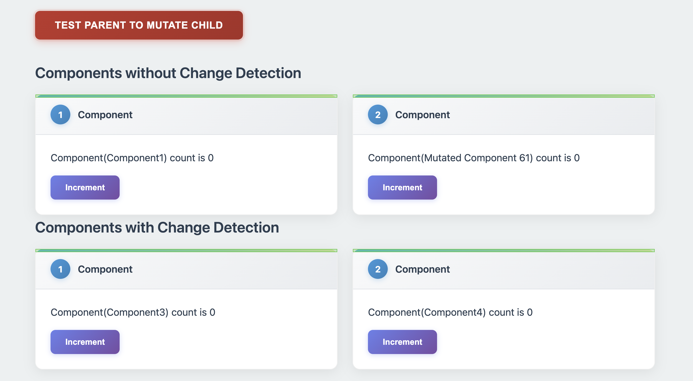
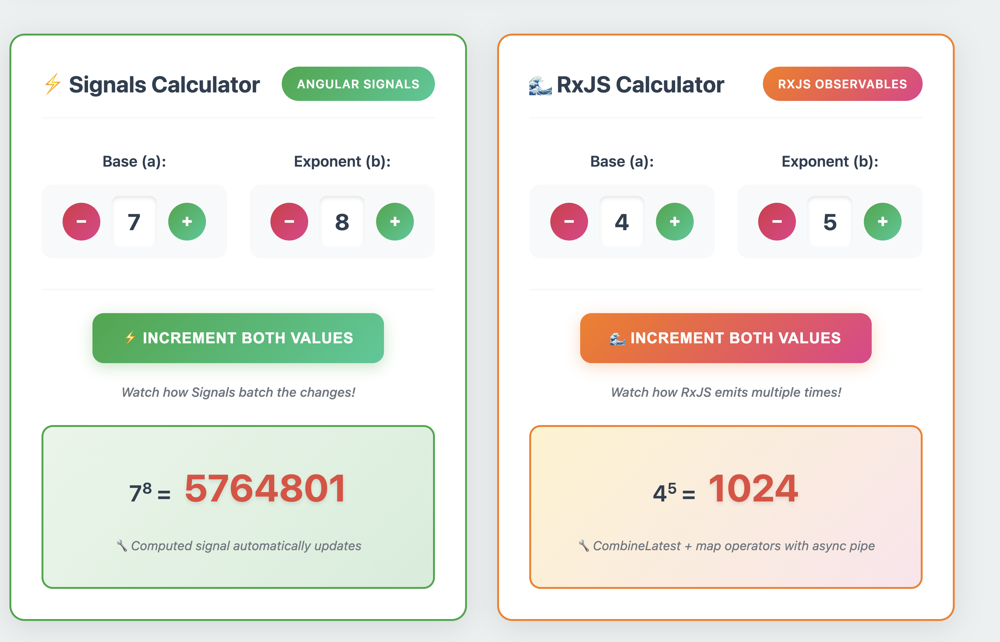
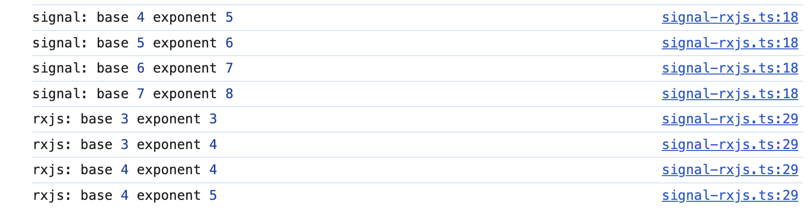

# 🚀 Angular Playground

A hands-on Angular research project demonstrating modern Angular features, performance concepts, and state management patterns.

## 🎯 What's Inside

- **🔄 Change Detection Strategies** - Compare Default vs OnPush performance
- **⚡ State Management** - Signals vs RxJS reactive patterns
- **📊 Interactive Demos** - Live examples with visual feedback

## 🚀 Quick Start

```bash
# Install dependencies
npm install

# Start development server  
ng serve

# Open http://localhost:4200
```

## 📚 Research Topics

### 1. Change Detection (`/re-render-tree`)
Compare how Angular's default change detection vs OnPush strategy affects performance when parent components mutate child properties.

**Key Insight:** OnPush doesn't track parent mutations but is more performant. Default works automatically but checks everything.

### 2. State Management (`/signal-rxjs`) 
Interactive comparison between Angular Signals and RxJS for reactive state management using power calculation (a^b).

**Key Insight:** RxJS emits on every dependency change, Signals batch changes and compute once at the end.

### 3. Crypto Portfolio (`/crypto-portfolio`)
RxJS-based portfolio management with BehaviorSubjects, combineLatest, and reactive state patterns.

**Key Insight:** Advanced reactive composition with real-time updates and transaction history.

## 📸 Screenshots

### Change Detection Demo
  
*Testing parent mutation: Default components update, OnPush components don't*

### State Management Comparison

*Side-by-side calculators: Check console to see RxJS emits twice, Signals emit once*

### Batch Update Test

*Click "Increment Both Values" - RxJS logs 2 emissions, Signals log 1 emission*

### Crypto Portfolio Demo

*RxJS portfolio management with reactive asset tracking and transaction history*

## 🔧 Tech Stack

- Angular 18+
- TypeScript 5+  
- Angular Signals
- RxJS
- SASS

---

**Explore the live demos to understand the concepts hands-on! 🎮**
